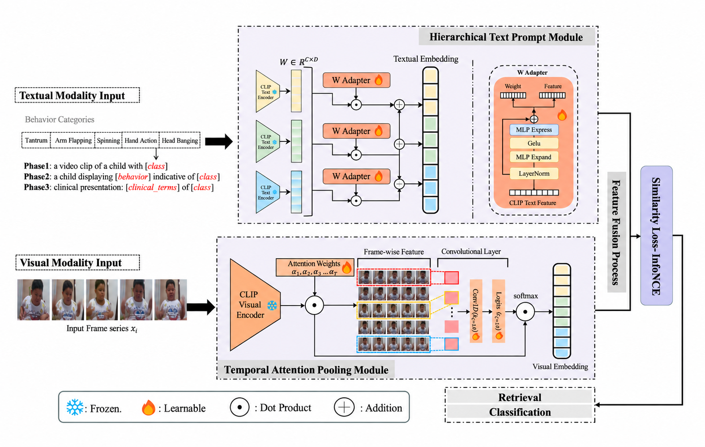

# 🧠 ATP-CLIP

### A Few-Shot Vision–Language Framework for Automated Atypical Behavior Analysis in Autism Spectrum Disorder

  <b>Few-Shot Learning · Vision-Language Modeling · Video Understanding · ASD Behavior Analysis</b>

---

## 📌 Overview

**ATP-CLIP** is a vision–language framework for automated atypical behavior analysis in **Autism Spectrum Disorder (ASD)**. It is designed for settings with limited labeled video data, where target behaviors often involve subtle motion patterns and long temporal dependencies. ATP-CLIP jointly models visual features and structured text descriptions in a shared vision–language embedding space for behavior recognition and retrieval.

Different from conventional ASD video analysis methods that mainly process short and pre-segmented clips, ATP-CLIP supports **few-shot behavior recognition** and **cross-modal retrieval** for long-form video analysis. The framework is developed together with **MVLASD**, a multimodal vision–language dataset containing naturalistic interaction videos, temporal behavior annotations, and clinician-validated text descriptions.

---

## ✨ Key Features

🎥 **Vision–Language Learning for ASD Analysis** aligns video features with behavior-related text representations in a shared embedding space. ⏱️ **Temporal Attention Pooling (TAP)** aggregates frame-level features with learnable temporal weights to capture informative motion patterns, while 📝 **Hierarchical Text Prompting** represents each behavior using class-level, behavior-level, and clinical-level descriptions.

🧩 **Few-Shot Adaptation** enables transfer from base classes to novel behavior classes using a small support set and prototype-based inference. 🔎 **Cross-Modal Retrieval** supports both video-to-text and text-to-video matching, while 🏥 **Clinically Grounded Text Representation** introduces structured behavior descriptions into the vision–language learning process.

---

## 🏗️ Framework

  

The overall architecture of **ATP-CLIP** contains a visual branch and a text branch that are aligned in a shared embedding space. The visual branch extracts frame-level features using the CLIP visual encoder and applies temporal modeling to generate a video representation, while the text branch encodes hierarchical behavior descriptions using the CLIP text encoder and lightweight adapters.

The resulting visual and text embeddings are optimized through similarity-based objectives and are used for both behavior classification and cross-modal retrieval. This shared representation allows ATP-CLIP to use the same vision–language feature space for standard classification, few-shot transfer, and bidirectional video–text matching.

### 📝 Hierarchical Text Prompt Module

The text branch represents each atypical behavior with three levels of prompts: the behavior class, the observable behavior description, and the clinical description. Compared with using only class names, this hierarchical prompt design provides richer text supervision and introduces different levels of semantic information during vision–language alignment.

Each prompt is encoded by the pretrained CLIP text encoder and further processed by a lightweight **W-Adapter**. The adapted text embeddings are then aligned with visual features in the shared embedding space, allowing the model to learn task-specific behavior representations while keeping the pretrained CLIP encoders frozen.

### 🎞️ Temporal Attention Pooling Module

The visual branch first encodes sampled video frames with a pretrained CLIP visual encoder to obtain a sequence of frame-level features. These features are passed to the **Temporal Attention Pooling (TAP)** module, which combines local temporal modeling with global frame similarity to estimate the importance of each frame.

The learned temporal weights are used to aggregate the frame features into a single video embedding. This design allows ATP-CLIP to capture both short-term motion patterns and longer temporal context while reducing the effect of less informative frames.

### 🔗 Vision–Language Alignment

ATP-CLIP maps visual and text features into the same embedding space and learns their correspondence using similarity-based objectives. During training, video representations are aligned with hierarchical text prompts so that samples from the same behavior class have higher visual–text similarity than mismatched pairs.

The learned embedding space is shared by **behavior classification** and **cross-modal retrieval**. For classification, predictions are based on similarities between video features and class representations, while retrieval ranks videos or text descriptions according to their cross-modal similarity.

---

## 📚 MVLASD Dataset

This work introduces **MVLASD**, a multimodal vision–language dataset for atypical behavior analysis in ASD. The dataset contains long-form naturalistic parent–child interaction videos together with episode-level temporal annotations and clinician-validated behavior descriptions, providing aligned visual and text data for multimodal learning.

Unlike existing datasets that mainly contain short behavior clips, MVLASD preserves longer temporal context and supports both behavior classification and cross-modal retrieval. The dataset is used to evaluate few-shot transfer, long-form video understanding, and video–text alignment in ASD behavior analysis.

### Dataset Characteristics

- 👦 Naturalistic parent–child interaction videos
- 🎥 Long-form video recordings
- 🏷️ Episode-level temporal annotations
- 👩‍⚕️ Clinician-validated behavior labels
- 📝 Text descriptions aligned with behavior episodes
- 🔎 Support for classification and cross-modal retrieval

### Behavior Categories

MVLASD contains five atypical behavior categories:

- **Tantrum**
- **Spinning**
- **Arm Flapping**
- **Hand Action**
- **Head Banging**

> ⚠️ **Privacy Notice**
>
> 

> MVLASD contains video recordings of minors and is therefore not publicly released. Research access may be provided upon reasonable request and is subject to institutional ethics approval and data protection requirements.
> 

---

## 🎯 Tasks

### 🎯 Atypical Behavior Classification

For behavior classification, ATP-CLIP encodes an input video into the shared vision–language embedding space and predicts its behavior category based on similarity to class representations. The same feature space is used across training and inference, avoiding a separate task-specific classifier for each novel class.

ATP-CLIP also supports **base-to-novel few-shot transfer**. The model is trained on base behavior classes and evaluated on unseen novel classes using a small support set, where class prototypes are constructed from visual support features and text embeddings.

### 🔎 Cross-Modal Retrieval

ATP-CLIP supports bidirectional retrieval between videos and text descriptions. **Video-to-Text (V2T)** retrieval ranks text descriptions according to their similarity to a query video, while **Text-to-Video (T2V)** retrieval ranks video segments using a text query.

Both retrieval tasks operate in the same shared embedding space used for classification. This allows the model to directly match behavior videos with structured text descriptions without introducing a separate retrieval network.

